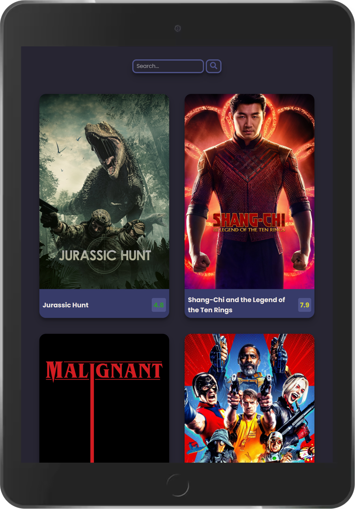

<h1 align="center"> Movie App   (React) </h1>

<i>A React based movie index SPA(Single Page Application), with search feature.</i>

## Table of Contents

- [Live Demo](#live-demo)
- [Description](#description)
- [Tech Stack](#tech-stack)
- [Key Features](#key-features)
- [Project Setup](#project-setup)
- [Future Scope](#future-scope)

## Live Demo

<h2 align="center"><a  href="https://ll-react-movie-app.netlify.app/">Live Demo Link</a></h2>

|                                              Mobile View                                              |                                       Tablet View                                        |
| :---------------------------------------------------------------------------------------------------: | :--------------------------------------------------------------------------------------: |
|  |  |

## Description

A React based movie index SPA(Single Page Application), with search feature.
This app powered by [TheMovieDB API](https://developers.themoviedb.org/3/getting-started/introduction), deployed on Netlify.

<!-- =============================================== -->

## Tech Stack

#### Frontend:

- React.js,
- React Hooks

#### Development:

- GIT - for version control
- Bash - for CLI
- NPM - for package managing
<!-- =============================================== -->

## Key Features

- Fetch data from REST API
- Search item based on name
- Animated item details with CSS
- Color coded movie rating
- Responsive design

## Project Setup

1. In root directory, run "npm install".
2. Then run "npm start".

## Future Scope

- Add individual item detail page
- Add pagination feature
